<!-- .slide: class="title-slide" -->

# ECE 448

Software Defined Radios

## Lesson 14 — HD Radio

Spring 2027 · Dr. Neil Rogers

---

## Where We Were

- Lesson 7 received an FM station and its RDS data.
- Lesson 13 decoded tones in bins, one FFT frequency at a time.
- Today we find a digital signal that sits beside an FM station.

Note:
Before class, run L14-hd-test-tx.grc once so L14-hd-test.sigmf-data and its .sigmf-meta sit next to L14-hd-find.grc. If the room has a PlutoSDR and an antenna, switch the finder to its PlutoSDR Source and find a local HD station on the waterfall ahead of time.

---

## Today's Plan

1. HD Radio modes and what is in the spectrum
2. The digital sidebands and OFDM
3. Recreating, finding, and measuring the sidebands in GNU Radio
4. Demodulating a real station to QPSK
5. Decoding it with gr-hdradio

Note:
This follows the slides: overview, spectrum, RBDS, sidebands, the OFDM concept and implementation, then tools. The demodulation and decoding at the end run on nrsc5's sample capture of KUT 90.5: before class, download sample.xz and L14-kut.sigmf-meta from the lesson page, unpack sample.xz, and rename it L14-kut.sigmf-data next to L14-hd-demod.grc and L14-hd-rx.grc.

---

## Find the Shelves on the Air

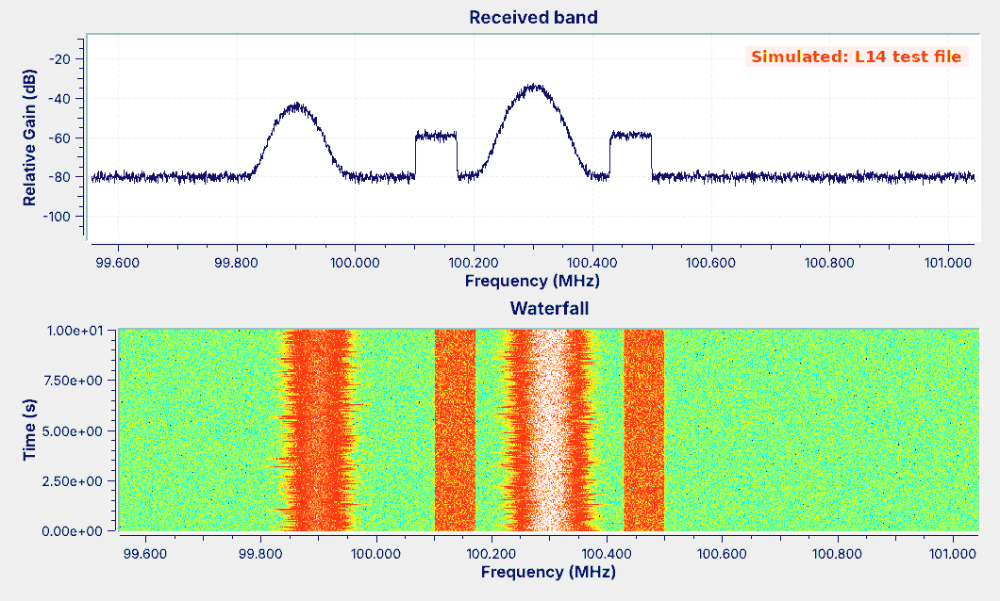

Run L14-hd-find.grc on the PlutoSDR at an FM station: flat bands beside it are HD Radio.

Note:
Live demo: in L14-hd-find.grc, disable the File Source and the six blocks after it, enable the PlutoSDR Source (1,488,375 samples per second, extended-frequency mode), and type a strong local station into Center. Drag a box across one shelf on the spectrum to zoom in. hdradio.com/stations lists the local HD stations. The figure is the finder playing the simulated test file.

---

## HD Radio Modes

- Hybrid keeps the analog host and adds a sideband on each side.
- Extended hybrid widens the sidebands inward; all digital drops the host.

Note:
NRSC-5 defines all three. Hybrid keeps about 130 kHz of analog signal on each side; extended hybrid limits it to about 100 kHz. Inside the host is Lesson 7's multiplex, with RBDS: differentially encoded BPSK at 1187.5 bits per second on 57 kHz. Demo if time allows: Lesson 7's L07-rds-rx.grc shows the station name.

---

## The Digital Sidebands

- Subcarriers are 363.4 Hz apart: one FFT bin at `fft_len` 4096.
- Each sideband is many narrow subcarriers, numbered 356 to 546.
- Partitions hold 18 data subcarriers and 1 reference subcarrier, which carries differential BPSK.
- The sidebands are much weaker than the host.

Note:
Subcarrier k sits at k times 363.4 Hz from the center. The reference subcarriers are 356, 375, 394, and every 19th up to 546. The meter's inner and outer Variables use these numbers.

---

## OFDM in GNU Radio

- OFDM subcarriers overlap, but each is zero at its neighbors' centers.
- An inverse FFT of `fft_len` = 4096 builds a symbol; each bin is one subcarrier.
- The cyclic prefix, `cp_len` = 224 samples, goes in front of each symbol.

Note:
Orthogonality is the O in OFDM, and it lets an FFT separate the subcarriers. The blocks are the OFDM Carrier Allocator, a reverse FFT, and the OFDM Cyclic Prefixer, as in the GNU Radio wiki's Basic OFDM Tutorial, which the slides link. The receiver finds where each symbol starts, drops the prefix, takes a forward FFT, and reads each subcarrier's point: the second half of today.

---

## OFDM Explorer

<a href="../viz/ofdm-explorer.html" target="_blank" rel="noopener">Open the OFDM explorer</a> (it is also on the lesson page).

- At spacing 1.00 every neighbor crosses zero at the center subcarrier.
- An echo longer than the guard reaches into the next symbol's FFT window.

Note:
Start at HD Radio: the red dots sit on zero. Move the spacing off 1.00 and the neighbors leak in. Drag the echo past the guard and the red sliver appears inside symbol 2's FFT window.

---

## The Test Signal

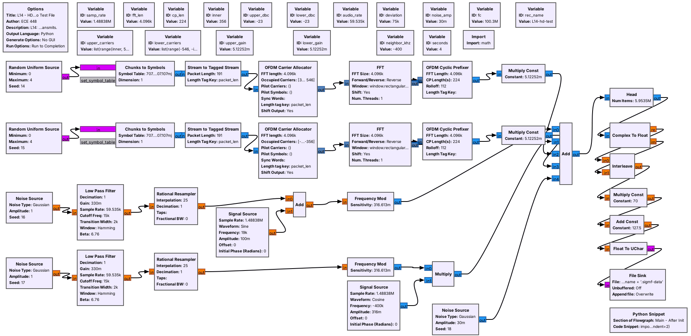

Each side carries random QPSK on subcarriers 356 to 546, written as unsigned bytes.

Note:
The FFT has 4096 points at 1,488,375 samples per second, so each bin is one subcarrier, and the guard is 224 samples. The symbols are random, not NRSC-5 data, so nrsc5 cannot decode this file. The 4 s file is 11.9 MB, in nrsc5's default format, cu8. The File Sink writes L14-hd-test.sigmf-data, and the write_meta Python Snippet writes the .sigmf-meta, because GNU Radio's SigMF Sink takes no cu8. Nothing transmits.

---

## Finding the Sidebands

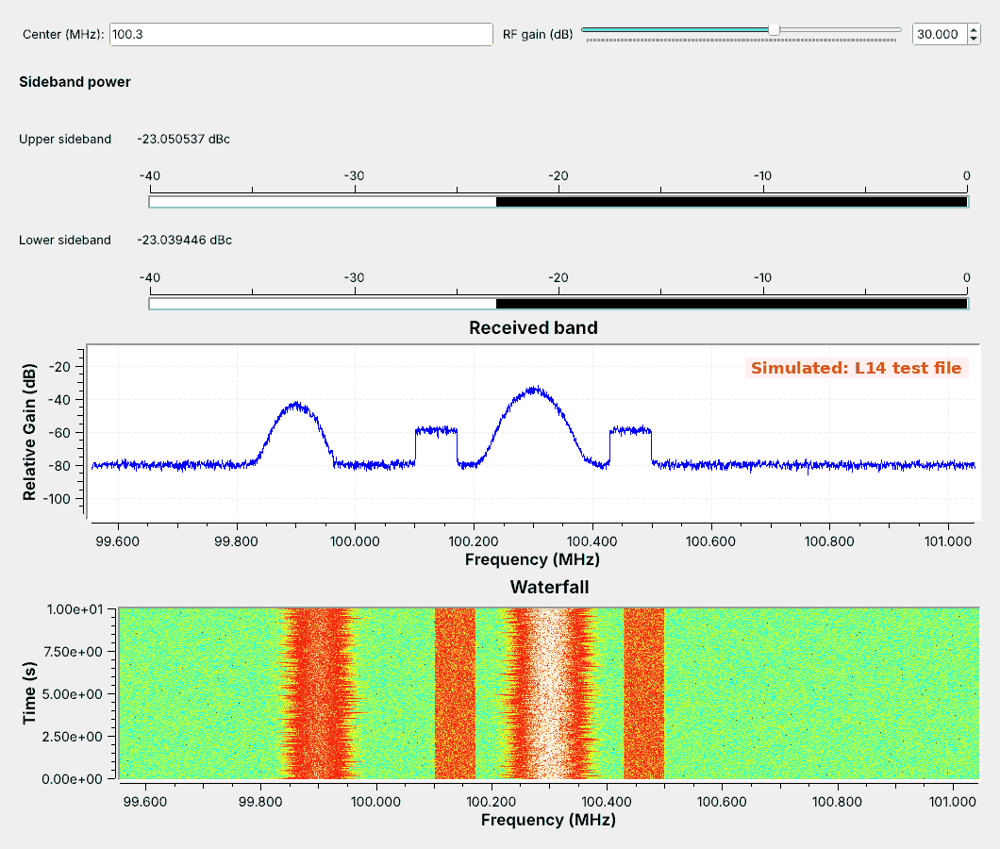

The shelves have flat tops and sharp edges, and their width never changes on the waterfall.

Note:
The figure comes from the simulated test file. In L14-hd-find.grc five blocks turn unsigned bytes into complex samples; to go live, select the File Source and the six blocks after it, press D, and enable the PlutoSDR Source. The shelves start at 100.1706 and 100.4294 MHz. The display shows power per bin, so the shelves' height is not the power ratio; the meters measure that.

---

## Measuring Sideband Power

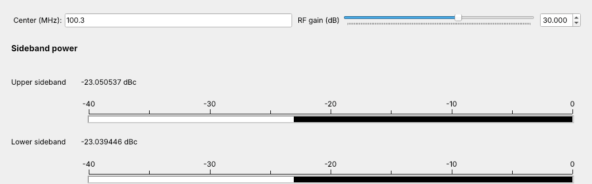

- Each meter shifts its band to 0 Hz, filters it, and averages $\vert x\vert^2$ for 0.2 s.
- The sideband meter minus the host meter gives dBc; a third reading compares the sides.

Note:
The host band is plus or minus 100 kHz, each sideband is plus or minus 34.7 kHz around plus or minus 163.9 kHz, and every filter decimates by 6. The nrsc5 project's real sample file reads about −24.3 and −23.8 dBc in the same flowgraph, close to the test file. On a live station the two meters need not agree.

---

## What Noise Does

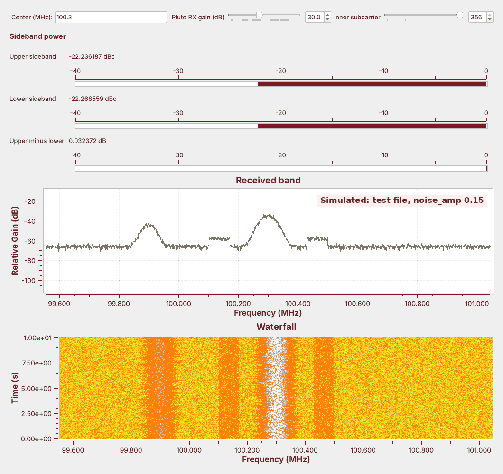

With `noise_amp` raised to 0.15, the shelves sink toward the floor and the meters read high.

Note:
Demo: change noise_amp from 0.03 to 0.15 in L14-hd-test-tx.grc, rerun it, rerun the finder. The floor rises about 14 dB and the meters read about 0.8 dB high, because the noise in each band adds to the sideband's power.

---

## From Sidebands to Symbols

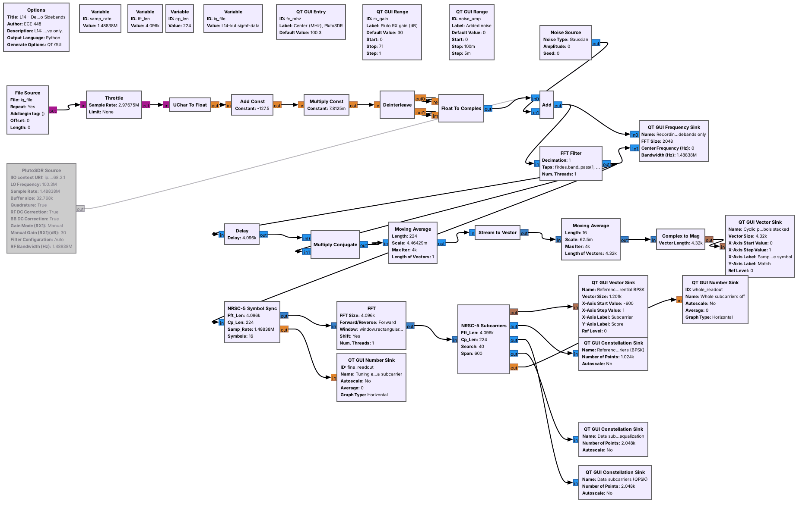

- A band-pass filter keeps the sidebands; the cyclic prefix marks each symbol.
- An FFT gives the subcarriers, and the references equalize the data.

Note:
L14-hd-demod.grc runs on nrsc5's sample capture of KUT 90.5, L14-kut.sigmf-data, in the same cu8 format at 1,488,375 S/s as the test file. Two steps are Embedded Python Blocks, Lesson 11's tool: double-click them to show the code.

---

## Finding Each Symbol

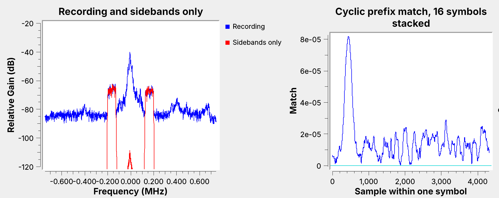

- Delay, Multiply Conjugate, and Moving Average compare each sample with the one `fft_len` later.
- The match peaks once per 4320-sample symbol.

Note:
The prefix is a copy of the symbol's last 224 samples, 4096 samples earlier, so only there do the products line up and add. Stacking 16 symbols leaves one clear peak. Without the band-pass filter, the host buries the peak. The angle of the match measures the tuning error within half a subcarrier, ±181.7 Hz: about 90 Hz on KUT, against nrsc5's 99 Hz.

---

## Reference Subcarriers

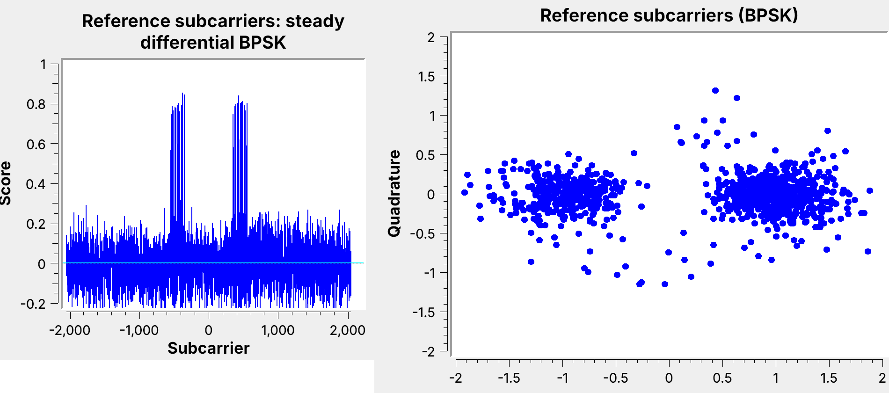

- The block multiplies each subcarrier by its own conjugate one symbol earlier.
- References give $+1$ or $-1$, so 22 spikes mark them.

Note:
Differential BPSK, as in Lesson 7's RDS: the channel's phase cancels between symbols. Data subcarriers change QPSK point every symbol, so their score stays near zero. Most reference bits repeat, so most points sit at +1. Demo on the Pluto: change Center by 0.0025 MHz; the pattern moves about 7 subcarriers and the block finds it again.

---

## Equalizing the Data Subcarriers

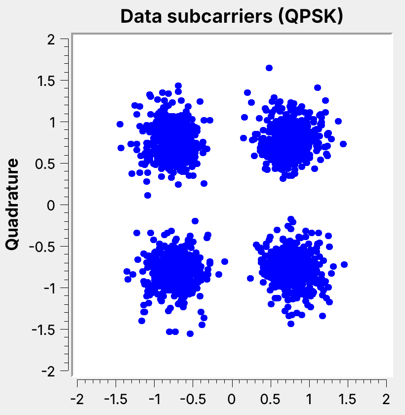

- The two references around each partition measure the channel there.
- Dividing each data subcarrier by that measurement leaves QPSK.

Note:
The block blends the two references' measurements by position across the partition, divides, and rotates 45° to the usual QPSK positions. 360 points per symbol, 180 from each sideband.

---

## Noise on the Constellation

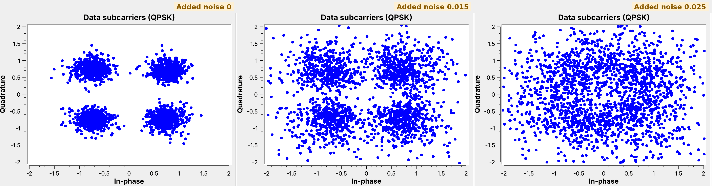

- Raise Added noise and every plot loses contrast.
- gr-hdradio still plays the capture at 0.035 and falls silent by 0.05.

Note:
Demo: drag Added noise up slowly. The clusters run together near 0.025, but the error-correcting code lets the decoder keep playing past that point.

---

## Decoding with gr-hdradio

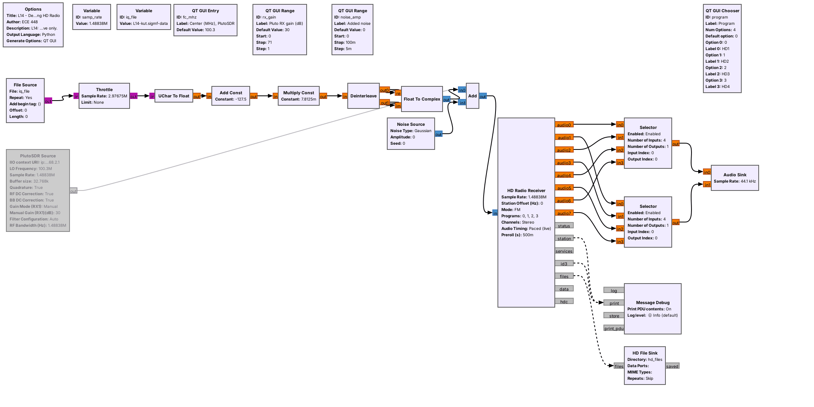

- HD Radio Receiver outputs each program's audio, the station and song, and album art.
- The Program buttons switch between HD1 and HD4.

Note:
gr-hdradio is the course's out-of-tree module, GNU Radio blocks over nrsc5's decoder library, which undoes the error-correcting code and decompresses the audio. Run L14-hd-rx.grc on the KUT capture: after about 5 s HD1 plays, and the console prints KUT, its slogan, and the program title. The files port saves album art to hd_files; KUT's capture carries none. Install steps are on the lesson page.

---

## Key Point

HD Radio adds two weak OFDM sidebands, 129.4 to 198.4 kHz from the station's center. The cyclic prefix marks each symbol, the references equalize the QPSK data, and gr-hdradio decodes it into audio.

---

## On the SDR

- Run the PlutoSDR at 1,488,375 samples per second, centered on the station.
- Look for shelves 129 to 198 kHz either side, with manual gain near 30 dB.
- The shelves should stand 10 dB above the floor.

Note:
Centering puts the Pluto's DC correction on the host, away from the meters. Manual gain, not the Pluto's AGC, so a reading at a given gain means the same thing every time. Overload buries the sidebands, so back off the gain if the floor rises. The finder, the demodulator, and the receiver all switch to the Pluto the same way, and nothing transmits.

---

## Looking Ahead

- The L14 Lab builds the meter, identifies a station's mode, and measures a live station.
- Lesson 15 recovers carrier phase and symbol timing for mPSK.

Note:
Today the cyclic prefix gave each symbol's timing and the references gave each subcarrier's phase. A single mPSK carrier has neither, so Lesson 15 recovers both from the signal itself.
